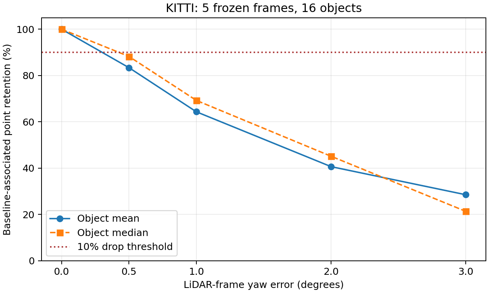
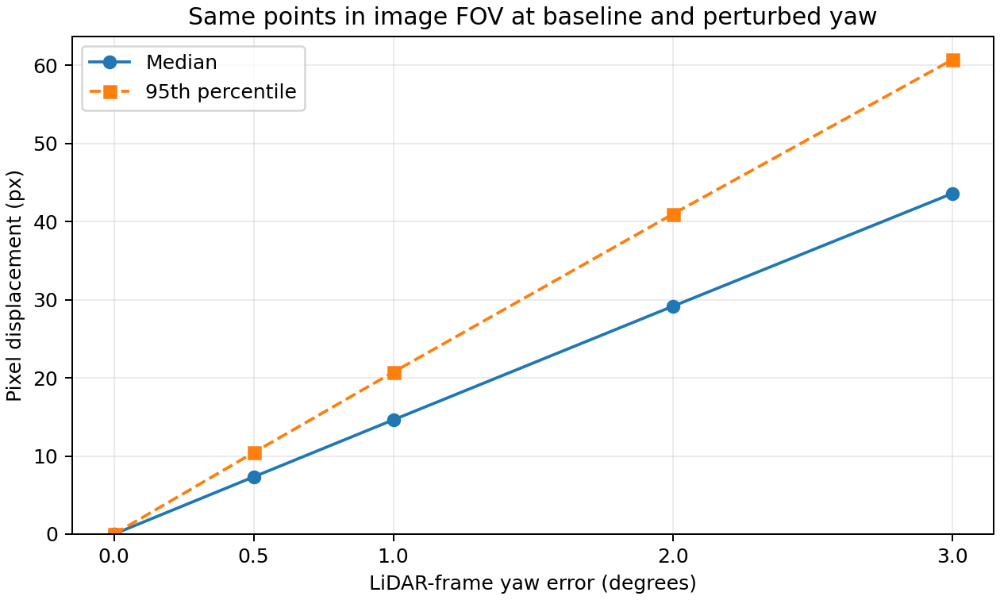
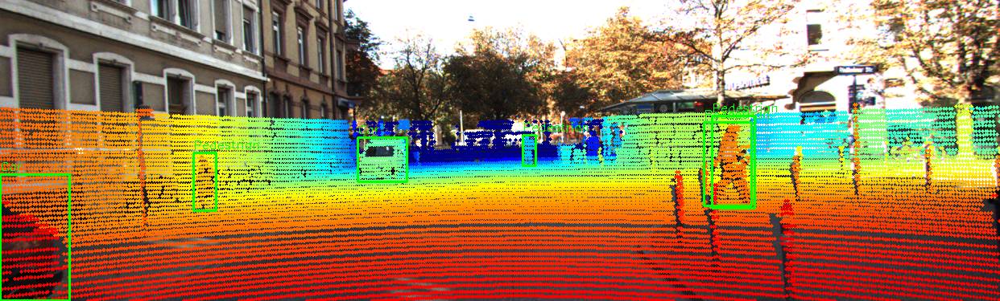

# Báo cáo Day 6: [ĐIỀN tên đề tài ngắn]

> Thay **mọi** ô có chữ ĐIỀN nằm trong ngoặc vuông bằng nội dung của bạn, xoá luôn cả dấu ngoặc vuông. Lệnh `python tools/check_submission.py` sẽ báo FAIL nếu còn sót bất kỳ chỗ nào.

- **Họ tên:** Dao Gia Bao (theo tên repo)
- **MSSV:** 2A202602793
- **Lớp:** Chưa xác nhận trong metadata; cần học viên bổ sung
- **Link repo:** https://github.com/kevindao94work/Dao_Gia_Bao-2A202602793-Track4-Day21
- **Topic:** A — LiDAR-camera projection QA
- **Dataset:** data/kitti_mini (định lượng); data/synthetic (sanity check)
- **Các frame đã dùng:** KITTI đánh giá: 000001, 000004, 000007, 000008, 000009; synthetic: 000000–000004; demo bổ sung: KITTI 000011

> Hãy viết ngắn: mỗi mục từ 3 đến 8 dòng, ưu tiên số liệu và hình ảnh.

## 1. Claim

**Giả thuyết CP1:** Sai lệch yaw extrinsic LiDAR-camera ít nhất 1° sẽ làm giảm mean retention của các điểm LiDAR liên kết với box 2D gốc ít nhất 10% so với calibration 0° trên các frame KITTI đã chọn.

Chốt trước khi chạy sweep: chọn 5 frame đầu tiên theo thứ tự ID có ảnh, LiDAR, calibration, label foreground và projection hợp lệ: **000001, 000004, 000007, 000008, 000009**.
Chỉ xét Car/Pedestrian/Cyclist; bỏ DontCare; giữ object có ≥5 điểm chiếu trong box ở baseline (16 object). Ngưỡng không đổi theo yaw.
Chỉ thay yaw **0°, 0.5°, 1°, 2°, 3°**; giữ frame, điểm, box, class, seed=42, roll/pitch/translation=0 và depth>0.1 m. Mỗi mức xuất phát từ calibration gốc.
Retention từng object = số điểm trong tập chỉ số baseline vẫn nằm trong cùng box / kích thước tập baseline; mất FOV/depth tính là mất điểm. Mean/median tính trên object, mỗi object trọng số bằng nhau.
Claim được hỗ trợ khi **mọi mức đã thử ≥1°** giảm ≥10% tương đối; không suy diễn cho mọi góc liên tục hoặc sensor khác. **Claim supported:** tại 1°, mean retention=64.3464%, giảm 35.6536%; tại 2°/3° giảm 59.3375%/71.4688%. Cả ba mức đã thử ≥1° vượt ngưỡng 10%.

## 2. Evidence

| Yaw (°) | Mean retention (%) | Median retention (%) | Giảm tương đối (%) | FOV (%) | Shift median / p95 (px) |
|---|---:|---:|---:|---:|---:|
| 0 | 100.00 | 100.00 | 0.00 | 31.427 | 0.00 / 0.00 |
| 0.5 | 83.39 | 88.24 | 16.61 | 31.442 | 7.32 / 10.43 |
| 1 | 64.35 | 69.26 | 35.65 | 31.424 | 14.62 / 20.73 |
| 2 | 40.66 | 45.15 | 59.34 | 31.375 | 29.15 / 40.94 |
| 3 | 28.53 | 21.35 | 71.47 | 31.405 | 43.58 / 60.69 |

Nguồn số: `results/yaw_perturb_sweep.csv`; kiểm toán từng object/frame: `yaw_perturb_sweep_details.csv`, `yaw_perturb_sweep_frames.csv`. 5 frame, 16 object; seed 42; không lấy mẫu ngẫu nhiên.
FOV = số điểm trong ảnh / số điểm camera hữu hạn có depth>0.1 m; lấy mean trên frame. Pixel shift Euclidean được gộp trên các điểm **trong FOV ở cả hai phép chiếu**, báo median/p95; số điểm chung được ghi CSV nên thấy rõ selection effect.
Mean retention giảm đơn điệu; FOV chỉ 31.375–31.442%, gần như không báo drift. Hai lần chạy cho cả ba CSV giống byte; không sửa số liệu thủ công.
Giới hạn: điểm trong box 2D có thể thuộc nền/đường, các box chồng nhau có thể đếm lại cùng điểm; baseline 100% là theo định nghĩa, không chứng minh calibration gốc hoàn hảo. 5 frame không chứng minh ngưỡng an toàn phổ quát hoặc hiệu năng detector.




Nguồn ảnh: KITTI Vision Benchmark Suite (CC BY-NC-SA 3.0); demo nuScenes (Motional, CC BY-NC-SA 4.0) chỉ kiểm tra adapter, chưa dùng để suy luận định lượng.

## 3. Failure case

Nêu khi nào hệ thống hoặc phương pháp fail, vì sao fail, và liên hệ tới lớp nào trong 6 lớp debug: I/O, Geometry, Time, Preprocess, Model, Metric.


[ĐIỀN]

## 4. Khuyến nghị nếu triển khai thật

Use-case cụ thể (ADAS / robot / drone), trade-off và bước tiếp theo.

[ĐIỀN]

## 5. Cách chạy lại

Các lệnh tái tạo lại toàn bộ kết quả từ repo sạch.

```bash
python -m venv .venv
source .venv/bin/activate
python -m pip install -r requirements.txt
python -m starter.projection --data-root data/synthetic --frame 000000
python -m starter.projection --data-root data/kitti_mini --frame 000011
python -m starter.projection --data-root data/nuscenes_mini_subset --frame scene-0103_010
python src/calibration_qa.py --data-root data/kitti_mini --frames 000001 000004 000007 000008 000009 --yaw-deg 0 0.5 1 2 3 --seed 42 --output-csv results/yaw_perturb_sweep.csv --figure-dir results/figures
```

Sanity số học: (10,0,0) → z_cam=9.727321 m, pixel=(613.964149,175.006537). Đã kiểm tra NaN/Inf, depth âm, input rỗng và denominator=0; không tạo pixel hợp lệ giả.

## 6. Khai báo sử dụng AI

Ghi rõ đã dùng công cụ AI nào, dùng vào việc gì, và bạn đã tự kiểm chứng kết quả đó bằng cách nào. Nếu không dùng AI, ghi "Không sử dụng". Xem quy định ở `RULES.md` mục 2.

| Công cụ | Dùng cho việc gì | Bạn đã kiểm chứng thế nào |
|---|---|---|
| [ĐIỀN] | | |
